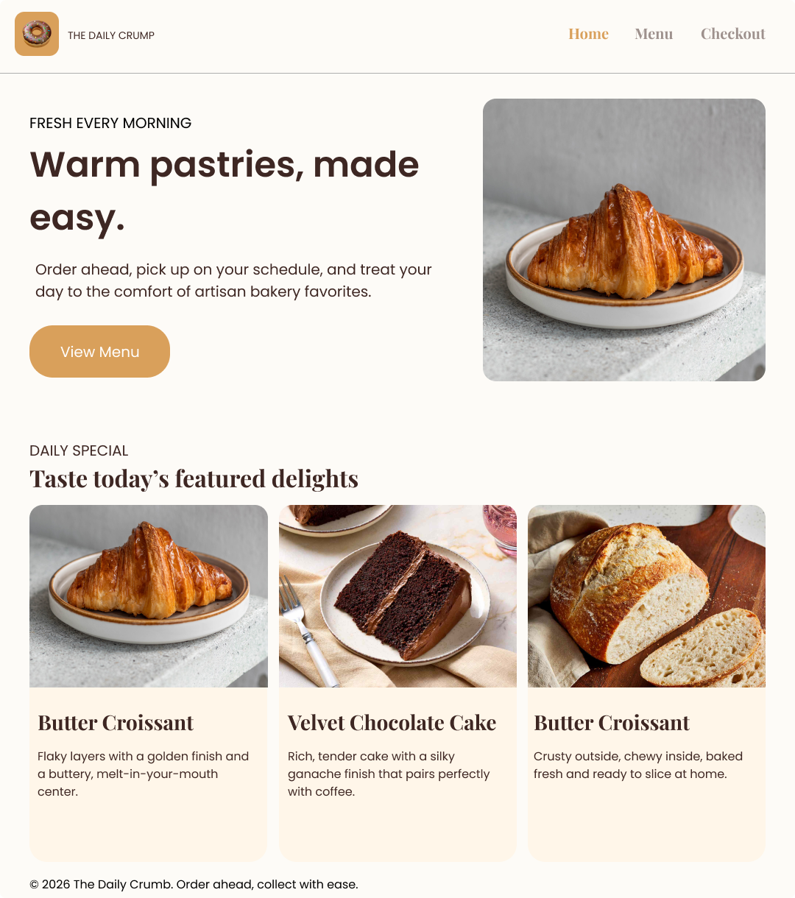
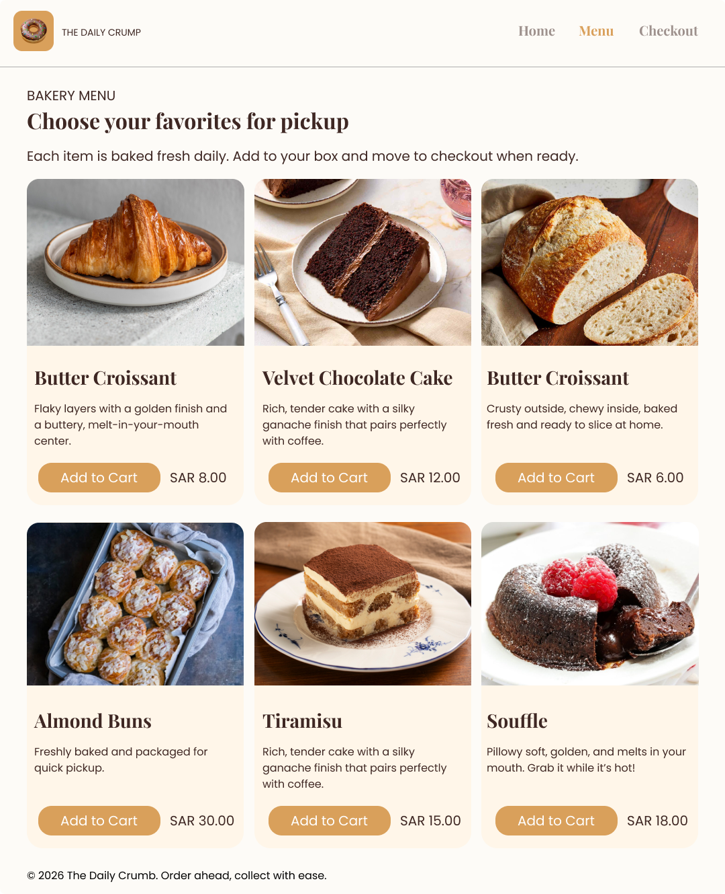
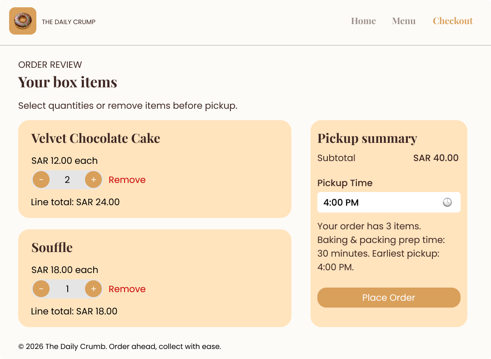

# The Daily Crumb

A small, semantic, and responsive Click & Collect web app for a local bakery built using HTML5, CSS3 and vanilla JavaScript. This project was created as a university milestone and follows a simple flat-file structure for easy review and grading.

---

**Project structure**
- `index.html` — Landing / Home with hero slideshow and Daily Specials
- `menu.html` — Menu grid and ordering UI
- `checkout.html` — Cart review, quantity controls, and pickup scheduling
- `style.css` — Shared stylesheet with the design system
- `app.js` — Shared JavaScript: product data, cart state (localStorage), UI rendering, and pickup-time logic
- `README.md` — This file

---

**Screenshots**

Homepage:



Menu:



Cart / Checkout:



---

**Design system & visual rationale**

See `Visual Aids.png` for an annotated guide; below is a short explanation of the key choices.

- Color Palette
  - Primary Background: Warm Cream — `#FDFBF7` — used for the overall page background to create a warm, inviting bakery tone.
  - Text / Headings: Dark Chocolate — `#3E2723` — high-contrast, friendly for headings and body copy.
  - Accent / Buttons: Honey Gold — `#D9A05B` — used for primary calls to action and to evoke honey/glaze tones.
  - Secondary / Borders: Soft Taupe — `#7D6B5D` — for subtle dividers and secondary UI elements.

- Typography
  - Headings: **Playfair Display** (serif) — gives an artisanal, crafted feel suited to a bakery brand.
  - Body / UI: **Inter** (sans-serif) — clean, legible, neutral for navigation and buttons.

Why these choices
- The warm cream background combined with honey gold accents creates a soft, appetizing palette that communicates freshness and handcrafted goods.
- Playfair Display provides visual contrast to the clean sans-serif body type, reinforcing the brand's artisanal character while keeping readability high.

---

**Core features**

- Semantic HTML5 layout with proper headings and ARIA-friendly attributes where needed.
- Responsive CSS Grid layout for the menu and flexible hero section.
- JavaScript-driven product data and cart state stored in `localStorage` for persistence across pages.
- Quantity controls appear immediately on the menu when an item is in the cart (Add button swaps to +/− controls).
- Checkout pickup-time logic:
  - Prep time formula: `15 + (5 * totalItems)` minutes.
  - The earliest pickup time is calculated from the current time and applied to the `<input type="time">` `min` attribute and default value.
  - User-facing feedback below the time input explains the calculation and earliest pickup time.
- Form validation prevents placing an order with an empty cart or a pickup time earlier than allowed.

---

**Developer notes**

- `menuItems` are declared in `app.js` as an array of objects:
```js
{ id, name, price, image }
```
- Prices are formatted as `SAR` in `formatPrice()` to show local currency.
- The hero uses a vanilla JS slideshow that reads images from the `menuItems` array so the hero visually matches the menu.

**Accessibility & testing notes**
- Buttons and form fields use semantic elements and visible focus states (use dev tools to verify).
- The slideshow has controls and visible pagination dots; consider adding `aria-live` adjustments for screen readers if the slideshow becomes more complex.